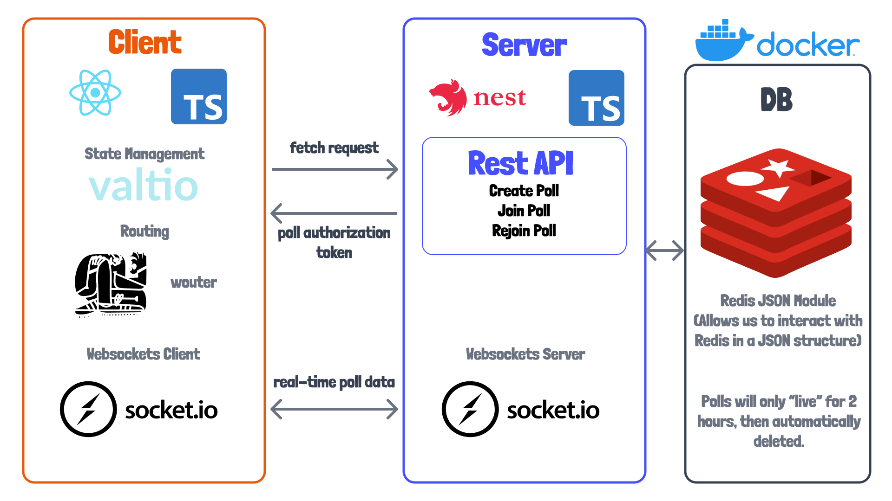

# Voting app

Đây là dự án với mục đích học tập của quá trình tìm hiểu xây dựng ứng dụng đánh giá, kiểm tra, bỏ phiếu xử lý theo thời gian thực, dựa trên websocket. 

<br />

---

<br />

## Mục lục

* [Tool và Framework được dùng trong dự án](#link-của-một-số-tools-và-frameworks-được-dùng-trong-dự-án)
* [Chạy ứng dụng](#chạy-ứng-dụng)
* [01 - Tổng Quan về "Architecture"](#01---tổng-quan-về-architecture)


<br />

---

<br />

## Link của một số Tools và Frameworks được dùng trong dự án

### Tổng quan
* [Typescript](https://www.typescriptlang.org/)
* [Docker](https://www.docker.com/products/docker-desktop)
* [Prettier](https://prettier.io/)
* [ESLint](https://eslint.org/docs/user-guide/getting-started)

### Frontend
* [Vite](https://vitejs.dev/)
* [React](https://reactjs.org/)
* [Valtio](https://github.com/pmndrs/valtio)
* [Wouter](https://github.com/molefrog/wouter)
* [Storybook](https://storybook.js.org/)
* [Socket.io Client](https://socket.io/docs/v4/client-api/)
* [Tailwind CSS](https://tailwindcss.com/)
* [react-use](https://github.com/streamich/react-use)

### Backend
* [NestJS](https://nestjs.com/)
* [Socket.io Server](https://socket.io/docs/v4/server-api/)
* [Redis-JSON](https://oss.redis.com/redisjson/)
* [Redis-JSON Docker Image](https://hub.docker.com/r/redislabs/rejson/)
* [JSON Web Token](https://jwt.io/)

**[⬆ Quay về Mục Lục](#mục-lục)**

<br />

---

<br />


## Chạy ứng dụng

Để chạy ứng dụng, bạn sẽ cần phải cài đặt một số công cụ hỗ trợ dưới đây:

Đầu tiên, cần có Docker hay Docker Desktop để có thể chạy lệnh `docker-compose`.

Thứ hai, cần NodeJS cho cả phía client hay server của ứng dụng. Khuyến nghị nên dùng [nvm](https://github.com/nvm-sh/nvm) hoặc [nvm-windows](https://github.com/coreybutler/nvm-windows) và đảm bảo tránh xung đột giữa các phiên bản Nodejs thì nên dùng phiên bản Nodejs v17.6.0 trong tệp [.nvmrc](/.nvmrc) trong thư mục gốc của dự án. Có thể chạy  `nvm use` để đảm bảo tính ổn định của phiên bản.

Để khởi động redis, ứng dụng Nest JS phía backend, ứng dụng React phía front-end thì trong thư mục gốc dự án ta chạy:

```sh
npm run start
```

Tệp `package.json` của thư mục gốc và các tập lệnh npm cơ bản chỉ để thuận tiện cho việc chạy tất cả các ứng dụng và cơ sở dữ liệu cùng một lúc.

**[⬆ Quay về Mục Lục](#mục-lục)**

<br />

---

<br />

## 01 - Tổng quan về "Architecture"

Hình ảnh bên dưới cung cấp tổng quan về các công cụ, ngôn ngữ hoặc frameworks được sử dụng để xây dựng ứng dụng này.



### Ứng dụng phía Client

Ứng dụng phía Client nằm bên trong thư mục `client`. Ứng dụng dựng trên nền có sẵn. Ứng dụng sử dụng [Vite](https://vitejs.dev/) làm công cụ phát triển front-end và được cấu hình dưới dependency cơ bản, sử dụng [Tailwind CSS](https://tailwindcss.com/) cho việc thiết kế, các tệp cho cấu hình [ESLint](https://eslint.org/docs/user-guide/getting-started) để hoạt động với [React](https://reactjs.org/), [Typescript](https://www.typescriptlang.org/) và  [Prettier](https://prettier.io/),.. Chạy trên cổng 8080.

### Ứng dụng phía Server 

Ứng dụng phía Server nằm bên trong thư mục `server`. Ứng dụng này được thiết lập để chạy [NestJS] (https://nestjs.com/), là framework để xây dựng máy chủ NodeJS phía ứng dụng Server. Dự án này cũng sử dụng cấu hình tương tự ([ESLint](https://eslint.org/docs/user-guide/getting-started), [Prettier](https://prettier.io/), [Typescript](https://www.typescriptlang.org/)) giống như phía Client. Chạy trên cổng 3000.

**[⬆ Quay về Mục Lục](#mục-lục)**

<br />

---

<br />


