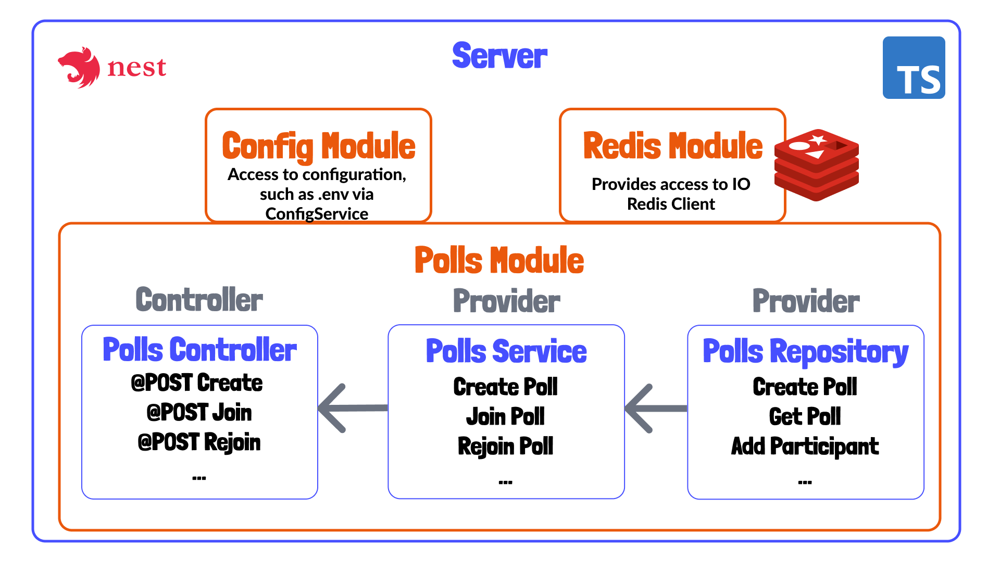

# Voting app

Đây là dự án với mục đích học tập của quá trình tìm hiểu xây dựng ứng dụng đánh giá, kiểm tra, bỏ phiếu xử lý theo thời gian thực, dựa trên websocket. 

<br />

---

<br />

## Mục lục

* [Tool và Framework được dùng trong dự án](#link-của-một-số-tools-và-frameworks-được-dùng-trong-dự-án)
* [Chạy ứng dụng](#chạy-ứng-dụng)
* [01 - Tổng Quan về "Architecture"](#01---tổng-quan-về-architecture)
* [02 - Thiết lập Rest API](#02---thiết-lập-rest-api)
* [03 - Thiết lập Polls Service](#03---thiết-lập-polls-service)
* [04 - Thiết lập Redis Module](#04---thiết-lập-redis-module)
* [05 - Thiết lập Polls Repository](#05---thiết-lập-polls-repository)
* [06 - Config JWT vào dự án](#06---config-jwt-vào-dự-án)


<br />

---

<br />

## Link của một số Tools và Frameworks được dùng trong dự án

### Tổng quan
* [Typescript](https://www.typescriptlang.org/)
* [Docker](https://www.docker.com/products/docker-desktop)
* [Prettier](https://prettier.io/)
* [ESLint](https://eslint.org/docs/user-guide/getting-started)

### Frontend
* [Vite](https://vitejs.dev/)
* [React](https://reactjs.org/)
* [Valtio](https://github.com/pmndrs/valtio)
* [Wouter](https://github.com/molefrog/wouter)
* [Storybook](https://storybook.js.org/)
* [Socket.io Client](https://socket.io/docs/v4/client-api/)
* [Tailwind CSS](https://tailwindcss.com/)
* [react-use](https://github.com/streamich/react-use)

### Backend
* [NestJS](https://nestjs.com/)
* [Socket.io Server](https://socket.io/docs/v4/server-api/)
* [Redis-JSON](https://oss.redis.com/redisjson/)
* [Redis-JSON Docker Image](https://hub.docker.com/r/redislabs/rejson/)
* [JSON Web Token](https://jwt.io/)

**[⬆ Quay về Mục Lục](#mục-lục)**

<br />

---

<br />


## Chạy ứng dụng

Để chạy ứng dụng, bạn sẽ cần phải cài đặt một số công cụ hỗ trợ dưới đây:

Đầu tiên, cần có Docker hay Docker Desktop để có thể chạy lệnh `docker-compose`.

Thứ hai, cần NodeJS cho cả phía client hay server của ứng dụng. Khuyến nghị nên dùng [nvm](https://github.com/nvm-sh/nvm) hoặc [nvm-windows](https://github.com/coreybutler/nvm-windows) và đảm bảo tránh xung đột giữa các phiên bản Nodejs thì nên dùng phiên bản Nodejs v17.6.0 trong tệp [.nvmrc](/.nvmrc) trong thư mục gốc của dự án. Có thể chạy  `nvm use` để đảm bảo tính ổn định của phiên bản.

Để khởi động redis, ứng dụng Nest JS phía backend, ứng dụng React phía front-end thì trong thư mục gốc dự án ta chạy:

```sh
npm run start
```

Tệp `package.json` của thư mục gốc và các tập lệnh npm cơ bản chỉ để thuận tiện cho việc chạy tất cả các ứng dụng và cơ sở dữ liệu cùng một lúc.

**[⬆ Quay về Mục Lục](#mục-lục)**

<br />

---

<br />

## 01 - Tổng quan về "Architecture"

Hình ảnh bên dưới cung cấp tổng quan về các công cụ, ngôn ngữ hoặc frameworks được sử dụng để xây dựng ứng dụng này.


### Ứng dụng phía Client

Ứng dụng phía Client nằm bên trong thư mục `client`. Ứng dụng dựng trên nền có sẵn. Ứng dụng sử dụng [Vite](https://vitejs.dev/) làm công cụ phát triển front-end và được cấu hình dưới dependency cơ bản, sử dụng [Tailwind CSS](https://tailwindcss.com/) cho việc thiết kế, các tệp cho cấu hình [ESLint](https://eslint.org/docs/user-guide/getting-started) để hoạt động với [React](https://reactjs.org/), [Typescript](https://www.typescriptlang.org/) và  [Prettier](https://prettier.io/),.. Chạy trên cổng 8080.

### Ứng dụng phía Server 

Ứng dụng phía Server nằm bên trong thư mục `server`. Ứng dụng này được thiết lập để chạy [NestJS] (https://nestjs.com/), là framework để xây dựng máy chủ NodeJS phía ứng dụng Server. Dự án này cũng sử dụng cấu hình tương tự ([ESLint](https://eslint.org/docs/user-guide/getting-started), [Prettier](https://prettier.io/), [Typescript](https://www.typescriptlang.org/)) giống như phía Client. Chạy trên cổng 3000.

**[⬆ Quay về Mục Lục](#mục-lục)**

<br />

---

<br />

## 02 - Thiết lập Rest API

### Imports 

Cấu hình biến môi trường cho CORS. Ở đây sẽ tiến hành hard-code cổng port của `CORS` . Tiến hành cấu hình file [.env](../server/.env).

```toml
PORT=3000
CLIENT_PORT=8080
REDIS_HOST=localhost
```

Thay vì truyền đối tượng CORS, ta ta có thể truy cập vào các đối tượng con có origin và chỉ định các cổng của client đến từ `ConfigService`. Sau đó tiến hành cấu hình động CORS cho `app`.

```ts
  const configService = app.get(ConfigService);
  const port = parseInt(configService.get('PORT'));
  const clientPort = parseInt(configService.get('CLIENT_PORT'));
  app.enableCors({
    origin: [
      `http://localhost:${clientPort}`,
      new RegExp(`/^http:\/\/192\.168\.1\.([1-9]|[1-9]\d):${clientPort}$/`),
    ],
  });
  await app.listen(port);
```

### Tạo Polls Module

Tạo thư mục `polls` chứa chức năng của ứng dụng. Trong thư mục `polls` tiến hành tạo file [polls.module.ts](../server/src/polls/polls.module.ts).

Import `Module, ConfigModule` để decorator từ `@nestjs`. 

```ts
import { Module } from '@nestjs/common';
import { ConfigModule } from '@nestjs/config';
```

Sau đó tiến hành tạo lớp `PollsModule`.


```ts
@Module({
  imports: [ConfigModule],
  controllers: [],
  providers: [],
})
export class PollsModule {}
```

Sau khi có Polls module, chúng ta cần ứng dụng có thể biết nó. Vì thế, chúng ta sẽ tiến hành đăng kí import module này vào file [app.module.ts](../server/src/app.module.ts) .

```ts
import { Module } from '@nestjs/common';
import { ConfigModule } from '@nestjs/config';
import { PollsModule } from './polls/polls.module';
@Module({
  imports: [ConfigModule.forRoot(), PollsModule],
  controllers: [],
  providers: [],
})
export class AppModule {}
```

### Thêm Polls Controller với Endpoints

Tạo file [polls.controller.ts](../server/src/polls/polls.controller.ts). Như các lớp mẫu, ta tiến hành tạo lớp `polls` controller. Chúng ta decorate controller này với Nest's built-in `@Controller` decorator. 

```ts
import { Controller, Logger, Post, Body } from '@nestjs/common';
@Controller('polls')
export class PollsController {
}
```

Sau đó tiến hành định nghĩa các route cho create, join, rejoin trong việc bỏ phiếu nhứ sau.

```ts
@Controller('polls')
export class PollsController {
  @Post()
  async create() {
    Logger.log('Create!');
  }
  @Post('/join')
  async join() {
    Logger.log('Join!');
  }
  @Post('/rejoin')
  async rejoin() {
    Logger.log('Rejoin!');
  }
}
```

*Sau đó tiến hành test với Postman lần lượt post request đến `localhost:8080/polls`, `localhost:8080/polls/join`, `localhost:8080/polls/rejoin*

### Định nghĩa Request Body cho Endpoints

Tạo file [dtos.ts](../server/src/polls/dtos.ts) và decorator như sau.

```ts
import { Length, IsInt, IsString, Min, Max } from 'class-validator';
export class CreatePollDto {
  @IsString()
  @Length(1, 100)
  topic: string;
  @IsInt()
  @Min(1)
  @Max(5)
  votesPerVoter: number;
  @IsString()
  @Length(1, 25)
  name: string;
}
export class JoinPollDto {
  @IsString()
  @Length(6, 6)
  pollID: string;
  @IsString()
  @Length(1, 18)
  name: string;
}
```

Quay về polls controller điều chỉnh lại các lớp.

```ts
@Controller('polls')
export class PollsController {
  @Post()
  async create(@Body() createPollDto: CreatePollDto) {
    Logger.log('Create!');
    return createPollDto;
  }
  @Post('/join')
  async join(@Body() joinPollDto: JoinPollDto) {
    Logger.log('Join!');
    return joinPollDto;
  }
  @Post('/rejoin')
  async rejoin() {
    Logger.log('Rejoin!');
    return {
      message: 'rejoin endpoint',
    };
  }
}
```

Sau đó tiến hành import `PollsController` trong file [polls.module.ts](../server/src/polls/polls.module.ts).

```ts
import { PollsController } from './polls.controller';
@Module({
  imports: [ConfigModule],
  controllers: [PollsController],
  providers: [],
})
export class PollsModule {}
```

Sau đó tiến hành test các endpoints. Ta nhận về các kết quả như sau:


*Tạo câu hỏi.*


*Người chơi tham gia.*


*Người chơi tham gia lại.*


**[⬆ Quay về Mục Lục](#mục-lục)**

<br />

---

<br />


## 03 - Thiết lập Polls Service

Chúng ta có thể thiết kế các Rest Endpoint với [NestJS's Controller](https://docs.nestjs.com/controllers). Định nghĩa của các request body đến là "đối tượng truyền dữ liệu(Data transfer object. DTO)" và validate bằng cho các trường dữ liệu request body bằng cách sử dụng thư viện `class-validator` được thiết kế.


### Ý tưởng

Sau khi lấy dữ liệu với 3 endpoints xử lý thì data sẽ được chuyển đến DB. Điều này có khả năng khến dịch vụ có thể dính `Injectable` hoặc các provider. Giải pháp đây là tạo hàm `createPoll` sẽ xử lý các bước được nêu trong sơ đồ. Logic đây rất nhiều thứ phức tạp. Việc tương tác với kho lưu trữ để duy trì  và truy xuất dữ liệu trong Redis, cũng như làm việc với các dịch vụ khác ("JWT").


### Tạo lớp Polls Service

Tạo file [polls.service.ts](../server/src/polls/polls.service.ts), file định nghĩa các loại [types.ts](../server/src/polls/types.ts), tệp này sẽ rất tốt để lưu trữ các loại cho các chức năng khác nhau trong các dịch vụ và kho lưu trữ.

Trong file [types.ts](../server/src/polls/types.ts), định nghĩa các tham số cho 3 phương thức dịch vụ.

```ts
export type CreatePollFields = {
  topic: string;
  votesPerVoter: number;
  name: string;
};
export type JoinPollFields = {
  pollID: string;
  name: string;
};
export type RejoinPollFields = {
  pollID: string;
  userID: string;
  name: string;
};
```

Tạo một lớp chứa 3 phương thức [polls.service.ts](../server/src/polls/polls.service.ts)!

```ts
import { Injectable } from '@nestjs/common';
import { CreatePollFields, JoinPollFields, RejoinPollFields } from './types';
@Injectable()
export class PollsService {
  async createPoll(fields: CreatePollFields) {}
  async joinPoll(fields: JoinPollFields) {}
  async rejoinPoll(fields: RejoinPollFields) {}
}
```

### Tạo lớp chứa ID trong Polls Service

Trong thư mục `src, tạo file [ids.ts](../server/src/ids.ts). Dùng package có thể tạo ID với thư viện gọi `nanoid`. Đây là package được cài trong thư mục server.

```ts
import { customAlphabet, nanoid } from 'nanoid';

export const createPollID = customAlphabet(
  '0123456789ABCDEFGHIJKLMNOPQRSTUVWXYZ',
  6,
);

export const createUserID = () => nanoid();
export const createNominationID = () => nanoid(8);
```

Hàm `createPollID` sử dụng bản chữ cái alphabet. Tạo một ID 6 ký tự cho các cuộc thăm dò chỉ bằng chữ in hoa và số. Điều này là do chúng tôi muốn tạo một ID cho trò chơi để có thể dễ dàng chia sẻ hoặc thông qua giữa bạn bè. Với độ  dài 21 kí tự

### Thêm phương thức logic

Setup file [polls.service.ts](../server/src/polls/polls.service.ts) lại như sau:

```ts
import { Injectable } from '@nestjs/common';
import { createPollID, createUserID } from 'src/ids';
import { CreatePollFields, JoinPollFields, RejoinPollFields } from './types';
@Injectable()
export class PollsService {
  async createPoll(fields: CreatePollFields) {
    const pollID = createPollID();
    const userID = createUserID();
    return {
      ...fields,
      userID,
      pollID,
    };
  }
  async joinPoll(fields: JoinPollFields) {
    const userID = createUserID();
    return {
      ...fields,
      userID,
    };
  }
  async rejoinPoll(fields: RejoinPollFields) {
    return fields;
  }
}
```

Trong `createPoll` chúng ta tạo `gameId` và `userId`. Trong `joinPoll` tạo `userId`, client sẽ cung cấp `pollId` khi có người ham gia.

### Truy cập Polls Service của Polls Controller

Dịch vụ thăm dò ý kiến ​​của chúng ta có thể truy cập được đối với các lớp khác bên trong module. Chúng ta thực hiện việc này bằng cách decorator các `Module` trong [polls.module.ts](../server/src/polls/polls.module.ts).

```ts
import { Module } from '@nestjs/common';
import { ConfigModule } from '@nestjs/config';
import { PollsController } from './polls.controller';
import { PollsService } from './polls.service';
@Module({
  imports: [ConfigModule],
  controllers: [PollsController],
  providers: [PollsService],
})
export class PollsModule {}
```

Đồng thời chỉnh sửa constructor trong [polls.controller.ts](../server/src/polls/polls.controller.ts).

```ts
import { PollsService } from './polls.service';
@Controller('polls')
export class PollsController {
  constructor(private pollsService: PollsService) {}
  
  // ...
}
```

Sau đó update các method quản lí service. Loại bỏ đi `Loger` và trả về kết quả tương ứng của mỗi method.

```ts
  @Post()
  async create(@Body() createPollDto: CreatePollDto) {
    const result = await this.pollsService.createPoll(createPollDto);
    return result;
  }
  @Post('/join')
  async join(@Body() joinPollDto: JoinPollDto) {
    const result = await this.pollsService.joinPoll(joinPollDto);
    return result;
  }
  @Post('/rejoin')
  async rejoin() {
    const result = await this.pollsService.rejoinPoll({
      name: 'From here',
            pollID: 'from token',
            userID: 'UserID token',
    });
    return result;
  }
```

### Testing với Postman

Tại thư mục root chạy app bằng lệnh `npm run start`.


**[⬆ Quay về Mục Lục](#mục-lục)**
<br />

---

<br />


## 04 - Thiết lập Redis Module

Tạo file [redis.module.ts](../server/src/redis.module.ts) trong root của thư mục server và thiết lập như cấu trúc sau.

```ts
import { DynamicModule } from '@nestjs/common';
import { Module } from '@nestjs/common';
import IORedis from 'ioredis';
@Module({})
export class RedisModule {
  static async registerAsync(): Promise<DynamicModule> {
    return {
      module: RedisModule,
      imports: [],
      providers: [],
      exports: [],
    };
  }
}
```
Cấu hình cho module này, loại phù hợp với những gì chúng ta đã thấy với module JWT.

```ts
import { DynamicModule, FactoryProvider, ModuleMetadata } from '@nestjs/common';
import { Module } from '@nestjs/common';
import IORedis, { Redis, RedisOptions } from 'ioredis';
type RedisModuleOptions = {
  connectionOptions: RedisOptions;
  onClientReady?: (client: Redis) => void;
};
type RedisAsyncModuleOptions = {
  useFactory: (
    ...args: any[]
  ) => Promise<RedisModuleOptions> | RedisModuleOptions;
} & Pick<ModuleMetadata, 'imports'> &
  Pick<FactoryProvider, 'inject'>;
@Module({})
export class RedisModule {
  static async registerAsync({
    useFactory,
    imports,
    inject,
  }: RedisAsyncModuleOptions): Promise<DynamicModule> {
```

Kiểu tiên chúng tôi tạo là `RedisModuleOptions`. Điều này sẽ chứa các tùy chọn khởi tạo `RedisClient`. Định nghĩa kiểu này do `IORedis` cung cấp. Tùy chọn thứ hai là một chức năng mà chúng ta có thể tùy chọn gọi khi máy khách đã sẵn sàng. Tôi thực hiện tùy chọn này với một dấu chấm hỏi,`?`. Đây là một hàm chúng ta có thể sử dụng để ghi nhật ký mà Redis đã sẵn sàng, hoặc có lẽ có một số logic phụ thuộc Redis khác mà chúng ta cần.

### Định nghĩa registerAsync

Xem `DynamicModule` trả về kết quả.

```ts
return {
      module: RedisModule,
      imports: imports,
      providers: [],
      exports: [],
    };
```
Định nghĩa và trả về mảng `providers`.

```ts
export const IORedisKey = 'IORedis';
    const redisProvider = {
      provide: IORedisKey,
      useFactory: async (...args) => {
        const { connectionOptions, onClientReady } = await useFactory(...args);

        const client = await new IORedis(connectionOptions);

        onClientReady(client);

        return client;
      },
      inject,
    };

    return {
      module: RedisModule,
      imports,
      providers: [redisProvider],
      exports: [redisProvider],
    };
```

### Tạo Module

Config động trong module. 

Import các module hỗ trợ cho RedisModule.

```ts
import { Logger } from '@nestjs/common';
import { ConfigModule, ConfigService } from '@nestjs/config';
import { RedisModule } from './redis.module';
```

Log kết quả kết nối trong module.

```ts
export const redisModule = RedisModule.registerAsync({
  imports: [ConfigModule],
  useFactory: async (configService: ConfigService) => {
    const logger = new Logger('RedisModule');

    return {
      connectionOptions: {
        host: configService.get('REDIS_HOST'),
        port: configService.get('REDIS_PORT'),
      },
      onClientReady: (client) => {
        logger.log('Redis client ready');

        client.on('error', (err) => {
          logger.error('Redis Client Error: ', err);
        });

        client.on('connect', () => {
          logger.log(
            `Connected to redis on ${client.options.host}:${client.options.port}`,
          );
        });
      },
    };
  },
  inject: [ConfigService],
});
```
### Thiết lập Module trong Polls Module và test

Cấu hình lại file [PollsModule](../server/src/polls/polls.module.ts).

```ts
import { redisModule } from 'src/modules.config';
@Module({
  imports: [ConfigModule, redisModule],
  controllers: [PollsController],
  providers: [PollsService],
})
export class PollsModule {}
```

Test app bằng cách trong thư mục root chạy `npm run start`. Nhớ settup file [docker-compose.yml](../docker-compose.yml) trong thư mục root.

Khi chạy ta nhận kết quả như sau:

```sh
LOG [RedisModule] Redis client ready
LOG [RedisModule] Connected to redis on localhost:6379
```


**[⬆ Quay về Mục Lục](#mục-lục)**
<br />

---

<br />

## 05 - Thiết lập Polls Repository

Như mô tả như sơ đồ bên dưới, chúng ta sẽ làm việc với `Polls Module`. Bằng việc sếp các khối `PollsRepository` chúng ta có thể lưu trữ, sắp xếp,truy xuất đến kho lưu trữ dữ diệu Redis.



### Tạo và inject lớp PollsRepository

Decorator lại file [polls.repository.ts](../server/src/polls/polls.repository.ts). 

```ts
import { Inject } from '@nestjs/common';
import { Injectable, Logger } from '@nestjs/common';
import { ConfigService } from '@nestjs/config';
import { Redis } from 'ioredis';
import { IORedisKey } from 'src/redis.module';
@Injectable()
export class PollsRepository {
  private readonly ttl: string;
  private readonly logger = new Logger(PollsRepository.name);
  constructor(
    configService: ConfigService,
    @Inject(IORedisKey) private readonly redisClient: Redis,
  ) {
    this.ttl = configService.get('POLL_DURATION');
  }
}
```

Tạo một lớp private `ttl`. Trong constructor, truy cập thông qua `configService` đã được cung cấp trong lớp [PollsModule](../server/src/polls/polls.module.ts) và gọi biến này đã được set trong file [.env file](../server/.env) với 7200s xấp xỉ gần 2 tiếng.

Khởi tạo phương thức để Log ra màn hình để debug, nó thường dùng trong môi trường production.

Config lại `PollsService`.


```ts
import { PollsRepository } from './polls.repository';
import { PollsService } from './polls.service';
@Module({
  imports: [ConfigModule, redisModule],
  controllers: [PollsController],
  providers: [PollsService, PollsRepository],
})
export class PollsModule {}
```

### Định nghĩa Kiểu

Tạo folder `shared` cùng cấp với `client` và `server`.

Set file [package.json](../package.json) tại thư mục root như sau:

```json /package.json
  "workspaces": [
    "client",
    "server",
    "shared"
  ],
```

Trong thư mục `shared` set [shared/package.json](../shared/package.json) như sau:

```json /shared/package.json
{
  "name": "shared",
  "version": "0.0.0",
  "main": "./index.ts",
  "types": "./index.ts",
  "license": "MIT",
  "devDependencies": {
    "@types/react": "^17.0.39",
    "@types/react-dom": "^17.0.13",
    "socket.io-client": "^4.4.1",
    "typescript": "^4.5.3"
  }
}
```

Config [tsconfig.json](../shared/tsconfig.json) :


```ts
{
  "compilerOptions": {
    "target": "ESNext",
    "lib": ["DOM", "DOM.Iterable", "ESNext"],
    "allowJs": false,
    "skipLibCheck": false,
    "esModuleInterop": true,
    "allowSyntheticDefaultImports": true,
    "strict": true,
    "forceConsistentCasingInFileNames": true,
    "module": "ESNext",
    "strictNullChecks": true,
    "moduleResolution": "Node",
    "resolveJsonModule": true,
    "isolatedModules": true,
    "noEmit": true,
    "jsx": "react",
  },
  "include": ["."]
}
```

Sau đó run `npm intsall` để cài đặt toàn bộ môi trường.

```sh
npm install
```


Config [poll-types.ts](../shared/poll-types.ts) như sau:


```ts
export interface Participants {
  [participantID: string]: string;
}
export interface Poll {
  id: string;
  topic: string;
  votesPerVoter: number;
  participants: Participants;
  adminID: string;
  // nominations: Nominations;
  // rankings: Rankings;
  // results: Results;
  // hasStarted: boolean;
}
```

Export kiểu trong file `index.ts` trong thư mục `shared`.

```ts index.ts
export * from './poll-types';
```

Set [types.ts](../server/src/polls/types.ts):

```ts types.ts
export type CreatePollData = {
  pollID: string;
  topic: string;
  votesPerVoter: number;
  userID: string;
};
export type AddParticipantData = {
  pollID: string;
  userID: string;
  name: string;
};
```

### Polls Repository Methods

Config `pollService` như sau :

```ts
// ...omitted content
import { Poll } from 'shared';
import { CreatePollData } from './types';
import { InternalServerErrorException } from '@nestjs/common/exceptions';
// ...omitted content
 async createPoll({
    votesPerVoter,
    topic,
    pollID,
    userID,
  }: CreatePollData): Promise<Poll> {
    const initialPoll = {
      id: pollID,
      topic,
      votesPerVoter,
      participants: {},
      adminID: userID,
    };
    this.logger.log(
      `Creating new poll: ${JSON.stringify(initialPoll, null, 2)} with TTL ${
        this.ttl
      }`,
    );
    const key = `polls:${pollID}`;
    try {
      await this.redisClient
        .multi([
          ['send_command', 'JSON.SET', key, '.', JSON.stringify(initialPoll)],
          ['expire', key, this.ttl],
        ])
        .exec();
      return initialPoll;
    } catch (e) {
      this.logger.error(
        `Failed to add poll ${JSON.stringify(initialPoll)}\n${e}`,
      );
      throw new InternalServerErrorException();
    }
  }
```

Đầu tiên ta trích xuất dữ liệu sẽ được truyền khi hàm được gọi. Chúng ta set `pollID`, `toppic`, `admin`, `votesPerVoter` cho việc khởi tạo câu hỏi ban đầu. Trong trường hợp admin sẽ giữ vai trò người tạo câu hỏi. Vì thế không thể cho đối tượng người tham gia vào action này. Người dùng chỉ có thể dùng mã để connect với socket web.

Sau đó log ra màn hình.

Cuối cùng, cho đối tượng truyền vào Redis kiểu JSON.

Nếu thành công, trả về `initialPoll`, n=ngược lại sẽ ném ngoại lệ là một exception trả về status `500`.

Thêm method `getPoll` như sau:

```ts
  async getPoll(pollID: string): Promise<Poll> {
    this.logger.log(`Attempting to get poll with: ${pollID}`);
    const key = `polls:${pollID}`;
    try {
      const currentPoll = await this.redisClient.send_command(
        'JSON.GET',
        key,
        '.',
      );
      this.logger.verbose(currentPoll);
      // if (currentPoll?.hasStarted) {
      //   throw new BadRequestException('The poll has already started');
      // }
      return JSON.parse(currentPoll);
    } catch (e) {
      this.logger.error(`Failed to get pollID ${pollID}`);
      throw e;
    }
  }
```

Phương thức dành cho người tham gia.

```ts
// ...omitted content
import { AddParticipantData, CreatePollData } from './types';
//... omitted content
  async addParticipant({
    pollID,
    userID,
    name,
  }: AddParticipantData): Promise<Poll> {
    this.logger.log(
      `Attempting to add a participant with userID/name: ${userID}/${name} to pollID: ${pollID}`,
    );
    const key = `polls:${pollID}`;
    const participantPath = `.participants.${userID}`;
    try {
      await this.redisClient.send_command(
        'JSON.SET',
        key,
        participantPath,
        JSON.stringify(name),
      );
      const pollJSON = await this.redisClient.send_command(
        'JSON.GET',
        key,
        '.',
      );
      const poll = JSON.parse(pollJSON) as Poll;
      this.logger.debug(
        `Current Participants for pollID: ${pollID}:`,
        poll.participants,
      );
      return poll;
    } catch (e) {
      this.logger.error(
        `Failed to add a participant with userID/name: ${userID}/${name} to pollID: ${pollID}`,
      );
      throw e;
    }
  }
```

### Gọi Methods từ PollsService

Injected `PollsRepository` với constructor như sau:

```ts polls.service.ts
import { Injectable, Logger } from '@nestjs/common';
// ... omitted content
import { PollsRepository } from './polls.repository';
// ... omitted content
@Injectable()
export class PollsService {
  private readonly logger = new Logger(PollsService.name);
  constructor(private readonly pollsRepository: PollsRepository) {}
  // ... omitted content
}
```

Update `createPoll`:

```ts
 async createPoll(fields: CreatePollFields) {
    const pollID = createPollID();
    const userID = createUserID();
    const createdPoll = await this.pollsRepository.createPoll({
      ...fields,
      pollID,
      userID,
    });
    // TODO - create an accessToken based off of pollID and userID
    return {
      poll: createdPoll,
      // accessToken
    };
  }
```

Update `joinPoll`.

```ts
  async joinPoll(poll: JoinPollFields) {
    const userID = createUserID();
    this.logger.debug(
      `Fetching poll with ID: ${poll.pollID} for user with ID: ${userID}`,
    );
    const joinedPoll = await this.pollsRepository.getPoll(poll.pollID);
    // TODO - create access Token
    return {
      poll: joinedPoll,
      // accessToken: signedString,
    };
  }
```

Update `rejoinPoll`.

```ts
  async rejoinPoll(fields: RejoinPollFields) {
    this.logger.debug(
      `Rejoining poll with ID: ${fields.pollID} for user with ID: ${fields.userID} with name: ${fields.name}`,
    );
    const joinedPoll = await this.pollsRepository.addParticipant(fields);
    return joinedPoll;
  }
```

**[⬆ Quay về Mục Lục](#mục-lục)**

<br />

---

<br />

## 06 - Config JWT vào dự án


### Setup JWT

Trong file [modules.config.ts](../server/src/modules.config.ts) nơi mà ta có thể dùng config [Redis Module](../server/src/redis.module.ts).

Đầu tiên, import module và thêm phương thức`registerAsync`. 

```ts
import { JwtModule } from '@nestjs/jwt';
// ... omitted content
export const jwtModule = JwtModule.registerAsync({});
```

Trong module này sẽ cần quyền truy cập vào `ConfigModule` và `ConfigService`.

```ts
export const jwtModule = JwtModule.registerAsync({
  imports: [ConfigModule],
  inject: [ConfigService],
});
```
Tiếp đó ta thêm function `useFactory` trả về JWT.

```ts
export const jwtModule = JwtModule.registerAsync({
  imports: [ConfigModule],
  useFactory: async (configService: ConfigService) => ({
    secret: configService.get<string>('JWT_SECRET'),
    signOptions: {
      expiresIn: parseInt(configService.get<string>('POLL_DURATION')),
    },
  }),
  inject: [ConfigService],
});
```

Ta đã set key bí mật trong file môi trường [.env](../server/.env).

Import và Register cho [polls.module.ts](../server/src/polls/polls.module.ts).

```ts
import { jwtModule, redisModule } from 'src/modules.config';
//... omitted content
@Module({
  imports: [ConfigModule, redisModule, jwtModule],
  controllers: [PollsController],
  providers: [PollsService, PollsRepository],
})
export class PollsModule {}
```

### Sign JWTs trong Polls Service

Thêm `jwtService` vào constructor.

```ts
import { JwtService } from '@nestjs/jwt';
//...content omitted
 constructor(
    private readonly pollsRepository: PollsRepository,
    private readonly jwtService: JwtService,
  ) {}
```

Phương thức `createPoll`.

```ts
    this.logger.debug(
      `Creating token string for pollID: ${createdPoll.id} and userID: ${userID}`,
    );
    const signedString = this.jwtService.sign(
      {
        pollID: createdPoll.id,
        name: fields.name,
      },
      {
        subject: userID,
      },
    );
    return {
      poll: createdPoll,
      accessToken: signedString,
    };
```

Phương thức `joinPoll`.

```ts
this.logger.debug(
      `Creating token string for pollID: ${joinedPoll.id} and userID: ${userID}`,
    );
    const signedString = this.jwtService.sign(
      {
        pollID: joinedPoll.id,
        name: poll.name,
      },
      {
        subject: userID,
      },
    );
    return {
      poll: joinedPoll,
      accessToken: signedString,
    };
```


**[⬆ Quay về Mục Lục](#mục-lục)**

<br />

---

<br />